# RASTRO-LINK · Análisis visual de vínculos

**Versión 2.1** · Herramienta local para investigadores · Creado por **S3GAD3**

RASTRO-LINK convierte los datos de una investigación (teléfonos, SIM, IMEI, personas, cuentas bancarias, correos, IP, wallets…) en un **grafo de entidades y vínculos**. En un solo lienzo se ve quién está relacionado con qué, de dónde sale cada dato y qué hipótesis quedan por confirmar.

Es un único archivo HTML. No necesita instalación, servidor ni conexión a Internet, y **ningún dato sale del equipo**.

Enlace a la herramienta web: https://s3gad3.github.io/rastro-link/

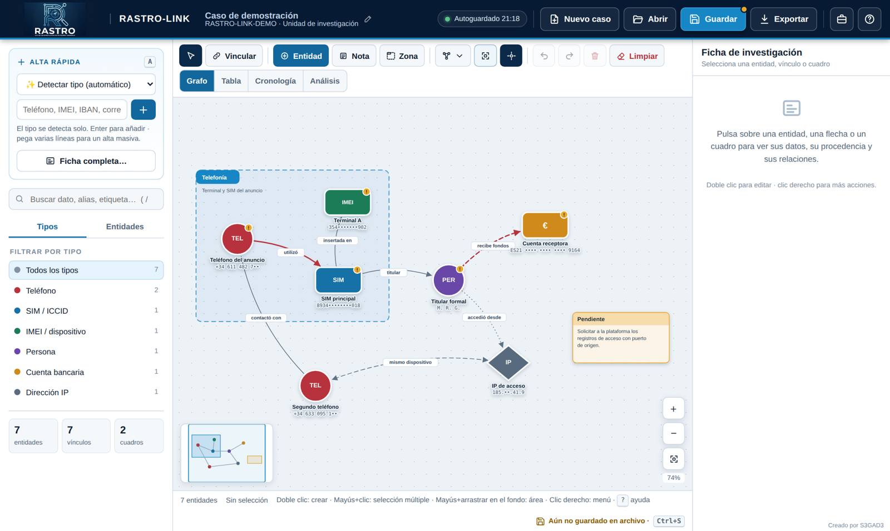

---

## Índice

1. [Para qué sirve](#1-para-qué-sirve)
2. [Puesta en marcha](#2-puesta-en-marcha)
3. [La pantalla de trabajo](#3-la-pantalla-de-trabajo)
4. [Añadir datos (entidades)](#4-añadir-datos-entidades)
5. [Tipos de dato y validación automática](#5-tipos-de-dato-y-validación-automática)
6. [Crear vínculos](#6-crear-vínculos)
7. [Notas y zonas](#7-notas-y-zonas)
8. [Seleccionar y editar (incluida la selección múltiple)](#8-seleccionar-y-editar)
9. [Moverse por el grafo y organizarlo](#9-moverse-por-el-grafo-y-organizarlo)
10. [Vistas: Tabla, Cronología y Análisis](#10-vistas-tabla-cronología-y-análisis)
11. [Casos, guardado y limpieza del lienzo](#11-casos-guardado-y-limpieza-del-lienzo)
12. [Importar datos](#12-importar-datos)
13. [Exportar resultados](#13-exportar-resultados)
14. [Atajos de teclado](#14-atajos-de-teclado)
15. [Seguridad y buenas prácticas](#15-seguridad-y-buenas-prácticas)
16. [Problemas frecuentes](#16-problemas-frecuentes)
17. [Limitaciones conocidas](#17-limitaciones-conocidas)
18. [Historial de versiones](#18-historial-de-versiones)

---

## 1. Para qué sirve

En una investigación de cibercrimen o de fraude los datos llegan dispersos: informes de operadoras, respuestas de plataformas, justificantes bancarios, denuncias de víctimas, capturas de pantalla… RASTRO-LINK permite:

| Necesidad del investigador | Cómo la resuelve RASTRO-LINK |
|---|---|
| **Ver la estructura del caso** de un vistazo | El grafo muestra las entidades y sus relaciones. Al seleccionar un dato se resaltan sus conexiones directas. |
| **Evitar errores de transcripción** | Valida al escribir el dígito de control de IMEI e ICCID (Luhn), el IBAN, la letra del DNI/NIE, el formato de las IP y las wallets de criptomonedas. |
| **Detectar coincidencias** | Avisa cuando un teléfono, cuenta o IMEI ya existe en el caso, aunque esté escrito de otra forma (espacios, prefijo +34…). |
| **Cruzar investigaciones** | *Fusionar* incorpora otro caso y etiqueta las entidades comunes como «cruce». |
| **Separar hechos de hipótesis** | Cada entidad tiene un estado (Confirmado, Probable, Pendiente, Descartado) y cada vínculo una certeza (Confirmada, Probable, Hipótesis), que se ve en el estilo de la línea. |
| **Mantener la trazabilidad** | Cada dato y cada vínculo guardan su fuente (atestado, folio, diligencia, informe) y su fecha. El análisis avisa de los datos sin fuente. |
| **Reconstruir la secuencia de hechos** | La *Cronología* ordena por fecha entidades y vínculos. |
| **Priorizar líneas de investigación** | El *Análisis* identifica los nodos más conectados, los datos aislados, los duplicados y los grupos desconectados. |
| **Documentar e informar** | Exporta a imagen PNG, informe PDF, CSV (Excel), JSON editable o un HTML autónomo con el caso dentro. |

Está pensada para trabajar deprisa. El alta rápida detecta el tipo de dato, se pueden pegar listas enteras, casi todo tiene atajo de teclado y cualquier operación se puede deshacer.

---

## 2. Puesta en marcha

1. Copia el archivo **`index.html`** en una carpeta de trabajo. También puedes utilizarla desde la versión web en el enlace https://s3gad3.github.io/rastro-link/
2. Ábrelo con doble clic en el navegador. Se recomiendan **Google Chrome** o **Microsoft Edge**, porque permiten guardar directamente sobre el mismo archivo. En Firefox también funciona, pero cada guardado se descarga como archivo nuevo.
3. La primera vez se carga un **caso de demostración** para explorar la herramienta. Para empezar tu propio caso pulsa **Nuevo caso**.

> No hace falta conexión a Internet. Todo el funcionamiento ocurre dentro del navegador.

**Primeros cinco minutos:**

1. **Nuevo caso** → escribe el nombre, la referencia (n.º de atestado o diligencias) y tu unidad.
2. En **Alta rápida** (panel izquierdo) pega un teléfono y pulsa `Enter`. Aparece en el grafo.
3. Pega un IBAN y pulsa `Enter`.
4. Mantén **Mayús** y arrastra del teléfono a la cuenta. Escribe la relación («transfirió a», «titular de»…) y guarda.
5. Pulsa **Guardar** para tener una copia del caso en archivo.

---

## 3. La pantalla de trabajo

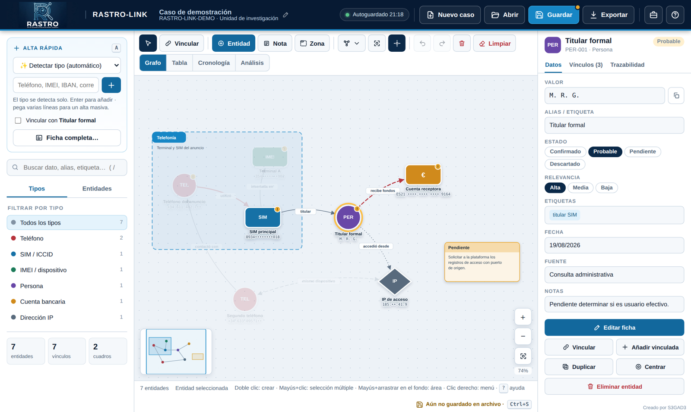

| Zona | Contenido |
|---|---|
| **Cabecera** | Nombre del caso (clic para editar sus datos), indicador de **autoguardado** y los botones **Nuevo caso**, **Abrir**, **Guardar** (azul), **Exportar**, **Datos del caso** (maletín) y **Ayuda** (?). Un **punto ámbar** sobre *Guardar* indica cambios aún no guardados en archivo. |
| **Panel izquierdo** | **Alta rápida**, botón **Ficha completa**, **buscador**, filtro por **tipos**, lista de **entidades** y contadores. |
| **Barra de herramientas** | Seleccionar · Vincular · + Entidad · Nota · Zona · Organizar · Encuadrar · Resaltar vecinos · Deshacer/Rehacer · Eliminar · **Limpiar** · selector de vista (Grafo, Tabla, Cronología, Análisis). |
| **Lienzo** | El grafo, con zoom (+ / − / encuadrar), porcentaje de zoom y **minimapa** (abajo a la izquierda). |
| **Panel derecho (ficha)** | Datos del elemento seleccionado en tres pestañas (**Datos**, **Vínculos**, **Trazabilidad**) y sus acciones. Con varios elementos seleccionados muestra las acciones de grupo. |
| **Barra inferior** | Entidades visibles, qué hay seleccionado, recordatorio de gestos y estado del guardado en archivo. |

**Cómo se lee un nodo:**

- El **color y la forma** indican el tipo de dato. Dentro aparece su abreviatura (TEL, SIM, IMEI, PER, €, @, IP…) o la imagen asociada.
- **Debajo** aparecen el alias (en negrita) y el valor.
- Un **círculo ámbar con «!»** señala que la relevancia es **alta**.
- Un **borde discontinuo** significa estado *Pendiente*, y un nodo **semitransparente**, *Descartado*.
- Un **anillo amarillo** marca que el nodo está seleccionado.

---

## 4. Añadir datos (entidades)

Hay cuatro formas de añadir datos. Todas llevan al mismo sitio.

### 4.1 Alta rápida (la más ágil)

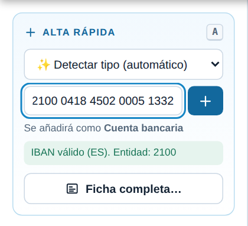

1. Escribe o pega el dato en la casilla (atajo: tecla `A`).
2. Con **«Detectar tipo (automático)»**, la herramienta reconoce el tipo y te lo indica antes de añadirlo («Se añadirá como Cuenta bancaria»). También muestra el resultado de la validación y avisa si el dato ya existe.
3. Pulsa `Enter` o el botón **+**.

Otras posibilidades del alta rápida:

- **Fijar el tipo** en el desplegable si no quieres detección automática.
- **Alta masiva**: si pegas varias líneas (por ejemplo, una columna copiada de Excel), la herramienta pregunta si quieres crear una entidad por línea, cada una con su tipo detectado.
- **Vincular con la selección**: si tienes una entidad seleccionada, marca *«Vincular con…»* y escribe la relación. Todo lo que añadas quedará conectado a ella, ideal para descargar de golpe los números de contacto de un teléfono o los movimientos de una cuenta.

### 4.2 Ficha completa

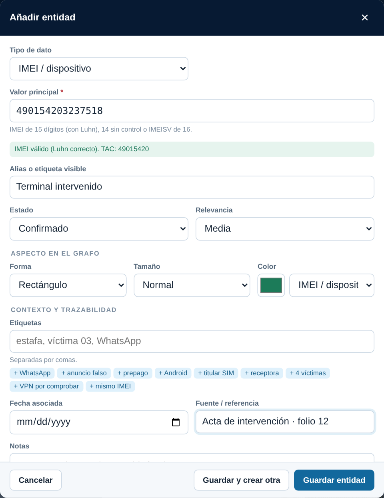

Se abre con **Ficha completa…**, el botón **+ Entidad** o la tecla `N`. Incluye todos los campos:

- **Tipo de dato** y **valor principal**. El ejemplo, la ayuda y la validación cambian con el tipo. Si escribes un valor de otro tipo, la herramienta te lo sugiere.
- **Alias o etiqueta visible**: el nombre corto que se ve en el grafo («Teléfono del anuncio», «Mula 2»…).
- **Estado** y **relevancia**.
- **Aspecto**:
  - forma: círculo, rectángulo, cuadrado, rombo o hexágono;
  - tamaño: pequeño, normal o grande;
  - color: libre o el de otro tipo.
- **Contexto y trazabilidad**:
  - etiquetas, con sugerencias de las ya usadas en el caso;
  - fecha asociada;
  - fuente o referencia;
  - notas;
  - una **imagen** (captura, foto, documento), que se reduce automáticamente y se guarda dentro del caso.

**Guardar y crear otra** mantiene el diálogo abierto para encadenar altas.

### 4.3 Doble clic en el lienzo

Haz doble clic en un espacio vacío: se abre la ficha y la entidad se crea en ese punto.

### 4.4 Entidad vinculada

Desde la ficha de una entidad, en **Añadir vinculada** o en el clic derecho, creas una entidad nueva. Al guardarla se abre directamente el diálogo del vínculo entre ambas.

---

## 5. Tipos de dato y validación automática

Cada tipo tiene su color, forma, ejemplo y ayuda. La validación **no bloquea** nada: solo informa en verde (correcto), en ámbar (revisar) o en gris (información).

| Tipo | Ejemplo | Qué se comprueba |
|---|---|---|
| Teléfono | `+34 600 000 000` | Caracteres válidos, longitud E.164 (≤ 15 dígitos) y prefijo internacional. |
| SIM / ICCID | `8934 0000 0000 0000 000` | 19–20 dígitos, empieza por 89 y **dígito de control Luhn**. |
| IMEI / dispositivo | `35 000000 000000 0` | 15 dígitos con **Luhn** (muestra el **TAC**); también reconoce IMEI de 14 dígitos e IMEISV de 16. |
| Persona | Nombre, iniciales o DNI/NIE | **Letra de control del DNI/NIE**. |
| Cuenta bancaria | `ES00 0000 0000 0000 0000 0000` | **IBAN** (mod-97 y longitud española) o tarjeta con Luhn. Muestra el código de entidad. |
| Correo electrónico | `usuario@dominio.com` | Formato; muestra el dominio. |
| Dirección IP | `203.0.113.10` · `2001:db8::1` | IPv4 o IPv6. Avisa si es **privada (RFC 1918)**, de **loopback** o de **CGNAT (100.64/10)**, en cuyo caso hace falta el puerto de origen y la hora exacta. |
| Dominio / URL | `ejemplo.com` | Formato; muestra el *host*. |
| Perfil social | `@usuario` o URL | Reconoce URL de perfil. Si detecta Instagram, TikTok, Telegram, etc., asigna este tipo. |
| Wallet cripto | `bc1q…` · `0x…` · `T…` | Identifica la red: Bitcoin (legacy y Bech32), Ethereum/EVM, TRON, Monero, Litecoin y, como posible, Solana. |
| Empresa | Razón social o CIF | Detecta el formato CIF. |
| Vehículo | `0000 BBB` | Matrícula española actual o bastidor (VIN) de 17 caracteres. |
| Ubicación | Dirección o `42.8782, -8.5448` | Coordenadas decimales dentro de rango. |
| Documento / evidencia | Nº, archivo o hash | — |
| Evento | Descripción breve | Aparece en la cronología si tiene fecha. |
| Otro tipo | Libre | Permite definir un tipo personalizado (arma, local…). |

Se admiten **valores enmascarados** con `•` o `*` (por ejemplo, `+34 611 482 7••`) para trabajar con datos parcialmente anonimizados. Estos valores no se validan.

**Detección de duplicados:** al escribir un valor que ya existe en el caso aparece en rojo *«Ya existe: TEL-001 …»* con un botón **Ver**. La comparación ignora espacios, guiones y el prefijo +34/0034.

---

## 6. Crear vínculos

Hay tres formas de conectar dos entidades:

1. **Mayús + arrastrar** desde una entidad y soltar sobre otra (la más rápida).
2. Botón **Vincular** (tecla `L`): pulsa primero el origen y después el destino. `Esc` cancela.
3. Desde la ficha o el clic derecho de una entidad: **Crear vínculo desde aquí**.

En el diálogo del vínculo:

- **Tipo de relación**: texto libre, con una lista de relaciones habituales. La herramienta **propone una** según los tipos: teléfono→SIM «utilizó», SIM→IMEI «insertada en», persona→cuenta «titular de», cuenta→cuenta «transfirió a»…
- **Invertir**: intercambia origen y destino.
- **Certeza**: *Confirmada* (línea continua), *Probable* (discontinua) o *Hipótesis* (punteada). El estilo cambia solo, aunque puedes ajustarlo.
- **Dirección** (→, ↔ o sin flecha), **grosor**, **color**, **fecha**, **fuente** y **detalle** (importe, frecuencia, contexto…).

Si hay varios vínculos entre las mismas dos entidades, se dibujan curvados para que no se solapen.

---

## 7. Notas y zonas

Además de entidades, puedes dibujar dos tipos de cuadro:

| | **Nota** (cuadro pequeño) · tecla `T` | **Zona** (cuadro grande) · tecla `G` |
|---|---|---|
| Uso | Anotaciones, conclusiones parciales, tareas pendientes. | Agrupar entidades: una organización, un entorno, un grupo de mulas, una hipótesis… |
| Aspecto | Tarjeta con título y texto. | Marco discontinuo con cabecera de color, detrás de las entidades. |
| Mover | Arrastra el cuadro. | Arrastra la **cabecera**: se mueve con todo lo que contiene. Con **Alt** se mueve solo el marco. |
| Tamaño | Arrastra la esquina inferior derecha. | Igual. |

Ambos tienen título, texto y color. Desde su ficha o el clic derecho se pueden **convertir** de nota a zona y viceversa. Con varias entidades seleccionadas, **Agrupar en una zona** crea una zona que las rodea.

---

## 8. Seleccionar y editar

### Selección simple

- **Clic** en una entidad, un vínculo (la línea o su etiqueta) o un cuadro para ver su ficha a la derecha.
- **Doble clic** o `Enter` para editarlo.
- **Clic en el fondo** o `Esc` para deseleccionar.

La ficha de una entidad permite, sin abrir el editor:

- **copiar el valor** al portapapeles;
- cambiar **estado** y **relevancia** con un clic;
- pulsar una **etiqueta** para buscar todas las entidades que la tienen;
- **Vincular**, **Añadir vinculada**, **Duplicar**, **Centrar** o **Eliminar**.

La pestaña **Vínculos** lista las relaciones (→ salientes, ← entrantes). La pestaña **Trazabilidad** muestra la fuente, la fecha, el estado, la fecha de alta y la última modificación.

### Selección múltiple

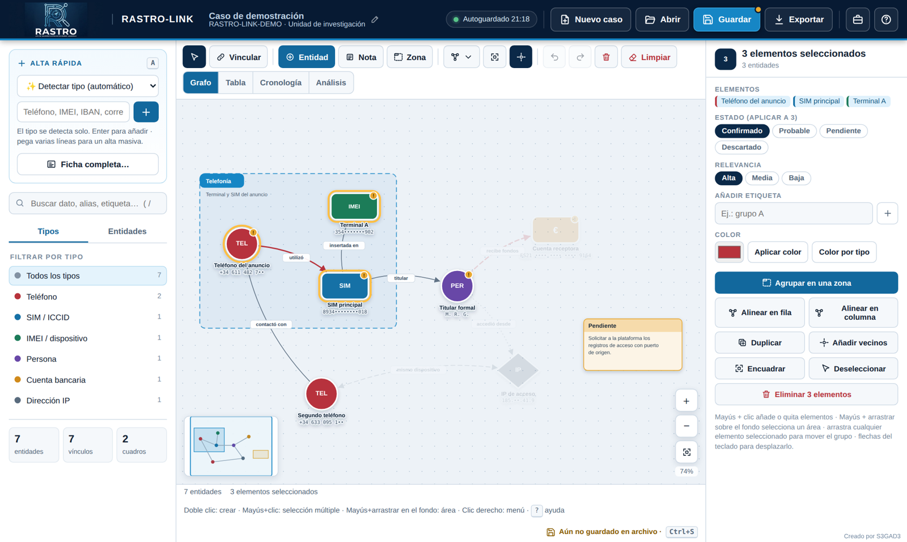

- **Mayús + clic** sobre entidades, vínculos o cuadros los **añade o quita** de la selección. También funciona en la lista de entidades del panel izquierdo.
- **Mayús + arrastrar sobre el fondo** dibuja un rectángulo y selecciona **todo lo que quede dentro**.
- `Ctrl + A` selecciona todo.
- **Arrastrar** cualquier elemento seleccionado **mueve el grupo entero**. Las **flechas del teclado** lo desplazan 10 px, o 50 px con Mayús.
- `Supr` **elimina toda la selección** (se puede deshacer).

Con varios elementos seleccionados, la ficha derecha ofrece:

- cambiar a la vez el **estado** y la **relevancia**;
- **añadir una etiqueta** y aplicar un **color**, o volver al color de cada tipo;
- **Agrupar en una zona**, **Alinear en fila** o **Alinear en columna**;
- **Duplicar** el grupo, conservando los vínculos internos;
- **Añadir vecinos** a la selección (amplía a todo lo conectado);
- **Encuadrar**, **Deseleccionar** o **Eliminar N elementos**.

### Menú contextual

El **clic derecho** abre un menú con las acciones del elemento pulsado, del grupo seleccionado o del lienzo (nueva entidad, nota o zona en ese punto, seleccionar todo, encuadrar, organizar o limpiar).

### Deshacer

Todas las operaciones se pueden deshacer con `Ctrl+Z` y rehacer con `Ctrl+Y`, hasta 60 pasos. Tras borrar, organizar o hacer un alta rápida aparece además un aviso con el botón **Deshacer**.

---

## 9. Moverse por el grafo y organizarlo

- **Rueda del ratón**: zoom hacia el puntero. Botones **+ / −** y teclas `+` / `-`.
- **Arrastrar el fondo**: desplazar el lienzo.
- **Encuadrar** (tecla `F`): ajusta la vista para ver todo.
- **Minimapa**: haz clic en cualquier punto para saltar allí.
- **Resaltar vecinos** (botón de mira): al seleccionar algo, atenúa lo que no está conectado con ello. Se puede desactivar.
- **Buscador** (tecla `/`): filtra por valor, alias, ID, fuente, notas, tipo, estado o etiquetas. `Enter` centra el primer resultado.
- **Filtro por tipo**: en el panel izquierdo, muestra solo un tipo de dato.
- **Organizar ▾**:
  - **Por relaciones (fuerzas)**: acerca lo conectado y separa lo que no lo está. Revela agrupaciones naturales.
  - **Agrupar por tipo**: coloca juntos los datos del mismo tipo.
  - **En cuadrícula**: orden regular.

---

## 10. Vistas: Tabla, Cronología y Análisis

### Tabla

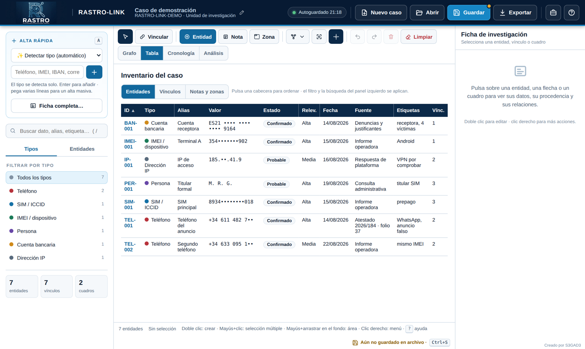

Inventario de **entidades**, **vínculos** o **notas y zonas**. Pulsa una cabecera para **ordenar**. El ID lleva al elemento en el grafo. Respeta el filtro y la búsqueda del panel izquierdo.

### Cronología

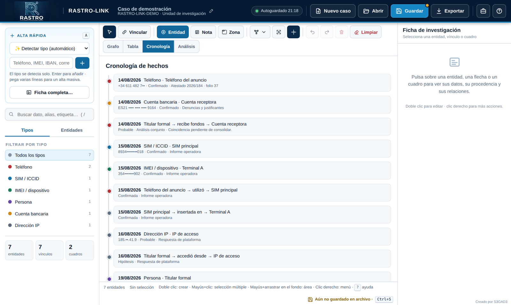

Ordena por fecha todas las entidades y vínculos que la tienen, con su fuente y su estado. Al pulsar un hecho se muestra en el grafo. Indica cuántos elementos no tienen fecha.

### Análisis

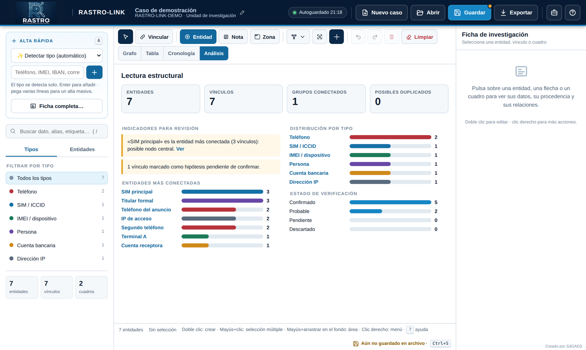

Lectura estructural automática del caso:

- **Indicadores**: entidades, vínculos, grupos conectados y posibles duplicados.
- **Alertas para revisión**:
  - nodo más conectado (posible nodo central) y valores repetidos en varias entidades;
  - entidades sin vínculos y entidades sin fuente documentada;
  - entidades descartadas que siguen vinculadas;
  - vínculos en hipótesis y grupos desconectados.
- **Entidades más conectadas**, **distribución por tipo** (al pulsar un tipo se filtra el grafo) y **estado de verificación**.

---

## 11. Casos, guardado y limpieza del lienzo

### Autoguardado en el navegador

Cada cambio se guarda automáticamente en el navegador (indicador verde **«Autoguardado HH:MM»**). Si cierras la pestaña, al volver encontrarás el caso tal como lo dejaste.

### Guardar en archivo (copia de seguridad)

**Guardar** (o `Ctrl+S`) crea un archivo **JSON** con el caso completo, imágenes incluidas.

- En **Chrome o Edge**, la primera vez eliges dónde guardarlo y los siguientes guardados **sobrescriben ese mismo archivo** sin preguntar.
- En otros navegadores se descarga en *Descargas*.
- **Guardar como…** (`Ctrl+Mayús+S` o *Exportar → Guardar como*) crea un archivo nuevo.

El **punto ámbar** del botón y la barra inferior («Aún no guardado en archivo» o «Cambios sin guardar en …») indican si el archivo está al día.

> **Importante:** el autoguardado vive en el navegador. Si se borran los datos de navegación o cambias de equipo, se pierde. **Guarda en archivo con regularidad.**

### Varios casos

- **Nuevo caso** crea un caso vacío. **El caso anterior no se borra**: queda en la biblioteca.
- **Abrir** (`Ctrl+O`) muestra la biblioteca de casos guardados en el navegador, con el número de entidades, vínculos y la fecha de modificación. Permite:
  - abrir o eliminar cualquier caso;
  - **Abrir archivo (.json / .html)**;
  - cargar la **demostración**.
- Si abres un archivo de un caso que ya está en el navegador, la herramienta compara fechas y pregunta si quieres **sustituir** la copia local o **abrirlo como copia**.

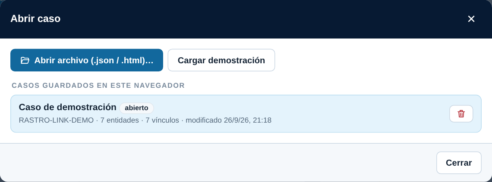

### Datos del caso

El botón del maletín, o un clic en el nombre del caso, abre el nombre, la referencia, la unidad y la descripción. Desde ahí también se accede a **Importar CSV/TSV**, **Plantilla CSV** y **Fusionar otro caso**.

### Limpiar el lienzo

El botón rojo **Limpiar** de la barra de herramientas (también en el clic derecho sobre el fondo) **borra todo el grafo** del caso actual (entidades, vínculos y cuadros) y deja el lienzo en blanco. Conserva el nombre y los demás datos del caso.

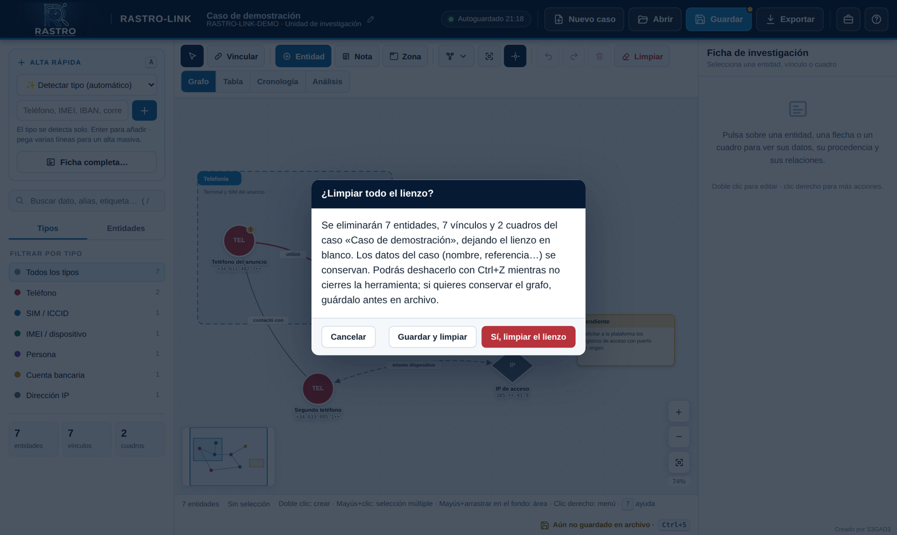

Antes de borrar aparece un **aviso de confirmación** que indica qué se va a eliminar, con tres opciones:

- **Cancelar**: no hace nada.
- **Guardar y limpiar**: guarda primero el caso en archivo y después limpia.
- **Sí, limpiar el lienzo**: limpia directamente.

Se puede deshacer con `Ctrl+Z` o con el botón *Deshacer* del aviso, mientras no cierres la herramienta.

### Fusionar casos (cruce de investigaciones)

**Datos del caso → Fusionar otro caso…** añade el contenido de otro caso (JSON o HTML exportado) al actual:

- Las entidades **con el mismo valor** no se duplican: se marcan con la etiqueta **«cruce: <nombre del otro caso>»**.
- Las nuevas se colocan a la derecha con la etiqueta **«origen: <caso>»**.
- Los vínculos se reconstruyen sobre las entidades resultantes.

Así se ve enseguida qué datos comparten dos investigaciones.

---

## 12. Importar datos

**Datos del caso → Importar CSV/TSV** añade filas al caso actual. Detecta el separador automáticamente (`;`, `,` o tabulador) y admite el formato que exporta Excel. Pulsa **Plantilla CSV** para descargar un ejemplo.

Columnas reconocidas (el orden no importa; no hace falta que estén todas):

| Columna | Contenido |
|---|---|
| `clase` | `entidad` o `vinculo` (si falta, se toma como entidad). |
| `id` | Identificador propio, para referenciarlo desde los vínculos del mismo archivo. |
| `tipo` | Nombre del tipo («Teléfono», «Cuenta bancaria»…), su clave (`phone`, `bank`…) o su prefijo (`TEL`, `BAN`…). **Si se deja vacío, se detecta a partir del valor.** |
| `valor` | El dato. También se aceptan `telefono`, `imei`, `email`, `iban`. |
| `alias`, `fecha`, `fuente`, `notas` | Campos descriptivos. |
| `etiquetas` | Separadas por `\|` o por comas. |
| `estado_certeza` | Estado de la entidad o certeza del vínculo. |
| `relevancia` | Alta, Media o Baja. |
| `origen`, `relacion`, `destino` | Solo en vínculos: IDs de origen y destino y tipo de relación. |

También puedes pegar directamente una columna de datos en **Alta rápida** (ver §4.1).

---

## 13. Exportar resultados

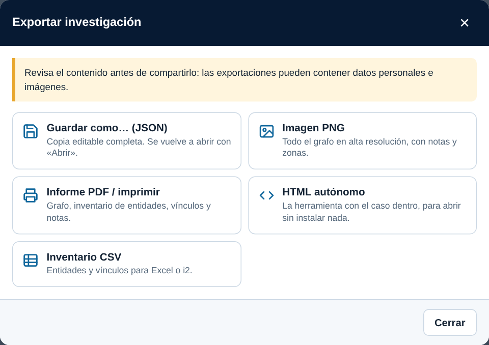

| Formato | Uso |
|---|---|
| **Guardar como… (JSON)** | Copia completa y editable. Es el formato de trabajo y de copia de seguridad. |
| **Imagen PNG** | Todo el grafo en alta resolución, con notas y zonas, listo para insertar en un informe. |
| **Informe PDF / imprimir** | Abre un informe con cabecera del caso, el grafo y las tablas de entidades, vínculos y notas. Se imprime o guarda como PDF en A4 apaisado. Si el navegador bloquea la ventana, permite las ventanas emergentes. |
| **HTML autónomo** | Un único archivo con la herramienta **y el caso dentro**. Se abre con doble clic en cualquier equipo, sin instalar nada. Útil para entregar el análisis a otro investigador o adjuntarlo a unas diligencias. |
| **Inventario CSV** | Entidades y vínculos en tabla (separador `;`, compatible con Excel), para otras herramientas de análisis. |

---

## 14. Atajos de teclado

| Acción | Atajo |
|---|---|
| Alta rápida | `A` |
| Ficha completa de entidad | `N` |
| Nota / Zona | `T` / `G` |
| Modo vincular / seleccionar | `L` / `V` |
| Buscar | `/` |
| Encuadrar todo | `F` |
| Zoom | `+` / `-` o rueda |
| Editar el elemento seleccionado | `Enter` |
| Seleccionar todo | `Ctrl + A` |
| Añadir o quitar de la selección | `Mayús + clic` |
| Seleccionar un área | `Mayús + arrastrar` sobre el fondo |
| Vincular dos entidades | `Mayús + arrastrar` de una entidad a otra |
| Mover la selección | `← ↑ → ↓` (con `Mayús`, más rápido) |
| Duplicar la selección | `Ctrl + D` |
| Eliminar la selección | `Supr` |
| Deshacer / rehacer | `Ctrl + Z` / `Ctrl + Y` |
| Guardar / guardar como | `Ctrl + S` / `Ctrl + Mayús + S` |
| Abrir caso | `Ctrl + O` |
| Cancelar, cerrar menús, deseleccionar | `Esc` |
| Ayuda | `?` |

Otros gestos: **doble clic** en el lienzo para crear una entidad, **clic derecho** para el menú contextual y **Alt + arrastrar** la cabecera de una zona para mover solo el marco.

---

## 15. Seguridad y buenas prácticas

- **Los datos no salen del equipo.** La herramienta no se conecta a ningún servidor ni envía información. Todo se guarda en el navegador y en los archivos que exportes.
- **Las exportaciones pueden contener datos personales e imágenes.** Revisa el contenido antes de compartirlo y aplica la normativa de protección de datos y los protocolos de tu unidad.
- **Minimiza los datos.** Si el informe va a circular, usa iniciales o valores enmascarados (`•`).
- **Separa hechos de inferencias.** Usa el estado de las entidades y la certeza de los vínculos, y documenta siempre la **fuente**. La vista de Análisis te avisará de lo que falte.
- **Haz copias de seguridad** con *Guardar* (JSON). El autoguardado del navegador **no sustituye** a una copia en archivo.
- En equipos compartidos, **elimina el caso de la biblioteca** (*Abrir → papelera*) cuando termines.
- Las IP privadas o de CGNAT no identifican por sí solas un acceso. Anota siempre la **fecha, la hora UTC y el puerto de origen**.

---

## 16. Problemas frecuentes

**«No se pudo autoguardar en el navegador».**
El navegador tiene un límite de espacio (unos 5 MB), y las imágenes lo consumen rápido. Guarda el caso en archivo (JSON) y elimina de la biblioteca los casos que ya no uses, o reduce el número de imágenes.

**Pulso Guardar y se descarga un archivo nuevo cada vez.**
Tu navegador no permite escribir sobre el mismo archivo (Firefox, Safari o el archivo abierto dentro de otra aplicación). Usa Chrome o Edge, o renombra las versiones.

**El informe PDF no se abre.**
El navegador ha bloqueado la ventana emergente. Permítela para este archivo y vuelve a pulsar *Informe PDF*.

**No veo algunas entidades.**
Comprueba que no haya un **filtro por tipo** activo o texto en el **buscador**. La barra inferior indica «x de y entidades visibles (filtro activo)».

**He borrado algo por error.**
`Ctrl+Z` o el botón *Deshacer* del aviso. El historial se conserva mientras no recargues la página ni cambies de caso.

**Tenía un caso de la versión anterior.**
Al abrir esta versión, el caso guardado en el navegador se migra automáticamente a la biblioteca (botón **Abrir**). Los JSON y los HTML exportados con versiones anteriores también se pueden abrir.

---

## 17. Limitaciones conocidas

- *Organizar* recoloca las entidades, pero **las zonas no se mueven con ellas**: hay que recolocarlas a mano.
- El historial de deshacer se pierde al recargar la página o al cambiar de caso.
- El espacio del navegador es limitado (unos 5 MB por origen). Para casos con muchas imágenes, trabaja guardando en archivo.
- En pantallas de móvil la herramienta funciona, pero está pensada para usarse en un ordenador.

---

## 18. Historial de versiones

**2.1**
- Botón **Limpiar lienzo** con confirmación («Guardar y limpiar» incluido) y posibilidad de deshacer.
- **Selección múltiple**: Mayús + clic, selección por área (Mayús + arrastrar), `Ctrl+A` y arrastre del grupo.
- Acciones de grupo: estado, relevancia, etiqueta, color, alinear, agrupar en zona, duplicar con vínculos, añadir vecinos y eliminar.
- Desplazamiento de la selección con las flechas del teclado y menú contextual para grupos.

**2.0**
- Interfaz renovada con botones visibles (Nuevo caso, Abrir, **Guardar**, Exportar) e iconos.
- **Guardado real en archivo** (sobrescritura directa en Chrome/Edge) y biblioteca de casos en el navegador.
- **Alta rápida** con detección automática del tipo, alta masiva y vinculación inmediata.
- Ejemplos y ayudas específicos por tipo de dato; **validadores** (Luhn, IBAN, DNI/NIE, IP, wallets…) y **detección de duplicados**.
- **Notas** (cuadro pequeño) y **Zonas** (cuadro grande que agrupa); nuevas formas (cuadrado, hexágono) y tamaños.
- Vista **Cronología**; **Análisis** ampliado; organización automática por relaciones; minimapa navegable; menú contextual.
- Fusión de casos con marcado de cruces; importación CSV mejorada con plantilla.
- Correcciones: flechas visibles, PNG con estilos y grafo completo, exportación HTML fiable.

**0.1**
- Versión inicial: grafo de entidades y vínculos, tabla, análisis básico y exportaciones.

---

*RASTRO-LINK · Kit de investigación de fuentes abiertas · Creado por **S3GAD3***
